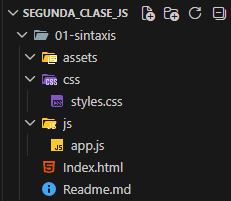
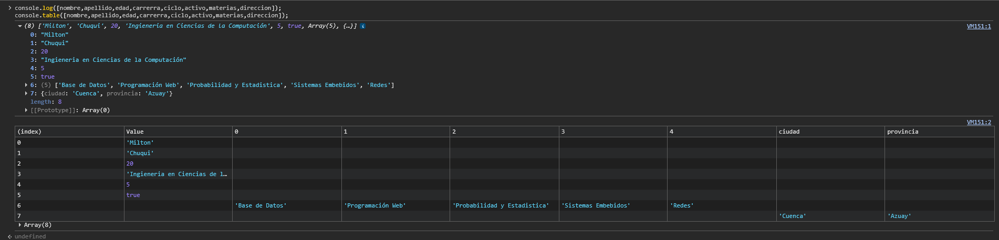
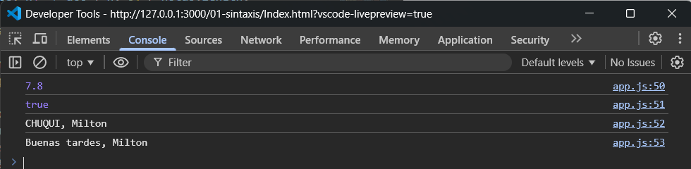
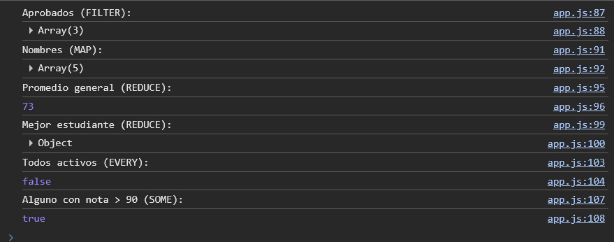
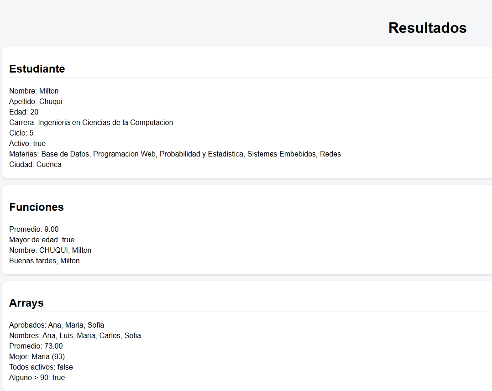

# Práctica 1

### 1. Estructura del Proyecto



**Descripción:** Organización de archivos del proyeto 

---

### 2. Consola: Variables y tipos



**Descripción:** Salida de console.log y console.table mostrando los valores de nombre,apellido,edad,carrerra,ciclo,activo,materias,dirección.

### 3. Funciones de utilidad


**Descripción:** Resultados de las funciones: PROMEDIO, MAYOR EDAD, NOMBRE, SALUDO. 

### 4. Operaciones con Arrays


**Descripción:** Resultados de las operaciones con arrays: FILTER, MAP, REDUCE, REDUCE, EVERY Y SOME

### 5. Pagina Renderizada


**Descripción:** Resultado de la pagina renderizada 

### 6. Código Fuente
```javascript
'use strict';

// ===== PASO 2 =====
const nombre = 'Milton';
const apellido = 'Chuqui';
let edad = 20;
const carrera = 'Ingenieria en Ciencias de la Computacion';
let ciclo = 5;
const activo = true;

const materias = [
  'Base de Datos',
  'Programacion Web',
  'Probabilidad y Estadistica',
  'Sistemas Embebidos',
  'Redes'
];

const direccion = {
  ciudad: 'Cuenca',
  provincia: 'Azuay'
};

console.log(nombre,apellido,edad,carrera,ciclo,activo,materias,direccion);
console.table(nombre,apellido,edad,carrera,ciclo,activo,materias,direccion);

// Mostrar en HTML
document.getElementById('nombre').textContent = `Nombre: ${nombre}`;
document.getElementById('apellido').textContent = `Apellido: ${apellido}`;
document.getElementById('edad').textContent = `Edad: ${edad}`;
document.getElementById('carrera').textContent = `Carrera: ${carrera}`;
document.getElementById('ciclo').textContent = `Ciclo: ${ciclo}`;
document.getElementById('activo').textContent = `Activo: ${activo}`;
document.getElementById('materias').textContent = `Materias: ${materias.join(', ')}`;
document.getElementById('ciudad').textContent = `Ciudad: ${direccion.ciudad}`;


// PASO 3 
const calcularPromedio = (notas) =>
  notas.reduce((acc, n) => acc + n, 0) / notas.length;

const esMayorDeEdad = (edad) => edad >= 18;

const formatearNombre = (nombre, apellido) =>
  `${apellido.toUpperCase()}, ${nombre}`;

const generarSaludo = (nombre, hora) =>
  hora >= 6 && hora < 12
    ? `Buenos dias, ${nombre}`
    : hora >= 12 && hora < 18
      ? `Buenas tardes, ${nombre}`
      : `Buenas noches, ${nombre}`;


console.log(calcularPromedio([6, 8, 5,10,10]));
console.log(esMayorDeEdad(20));
console.log(formatearNombre("Milton", "Chuqui"));
console.log(generarSaludo("Milton", 14));


// Mostrar en HTML
document.getElementById('promedioNotas').textContent =
  `Promedio: ${calcularPromedio([10, 8, 9]).toFixed(2)}`;

document.getElementById('mayorEdad').textContent =
  `Mayor de edad: ${esMayorDeEdad(edad)}`;

document.getElementById('nombreFormateado').textContent =
  `Nombre: ${formatearNombre(nombre, apellido)}`;

document.getElementById('saludo').textContent =
  generarSaludo(nombre, 14);


// ---- PASO 4 ----
const estudiantes = [
  { nombre: 'Ana', nota: 85, activo: true },
  { nombre: 'Luis', nota: 42, activo: true },
  { nombre: 'Maria', nota: 93, activo: false },
  { nombre: 'Carlos', nota: 67, activo: true },
  { nombre: 'Sofia', nota: 78, activo: true }
];

const aprobados = estudiantes.filter(e => e.nota >= 70);
const nombres = estudiantes.map(e => e.nombre);
const promedio = estudiantes.reduce((acc, e) => acc + e.nota, 0) / estudiantes.length;
const mejor = estudiantes.reduce((max, e) => e.nota > max.nota ? e : max);
const todosActivos = estudiantes.every(e => e.activo === true);
const algunoMayor90 = estudiantes.some(e => e.nota > 90);

// Aprobados
console.log("Aprobados (FILTER):");
console.log(aprobados);

// Nombres
console.log("Nombres (MAP):");
console.log(nombres);

// Promedio
console.log("Promedio general (REDUCE):");
console.log(promedio);

// Mejor estudiante
console.log("Mejor estudiante (REDUCE):");
console.log(mejor);

// Todos activos
console.log("Todos activos (EVERY):");
console.log(todosActivos);

// Alguno mayor a 90
console.log("Alguno con nota > 90 (SOME):");
console.log(algunoMayor90);

// Mostrar en HTML
document.getElementById('aprobados').textContent =
  `Aprobados: ${aprobados.map(e => e.nombre).join(', ')}`;

document.getElementById('nombres').textContent =
  `Nombres: ${nombres.join(', ')}`;

document.getElementById('promedioGeneral').textContent =
  `Promedio: ${promedio.toFixed(2)}`;

document.getElementById('mejor').textContent =
  `Mejor: ${mejor.nombre} (${mejor.nota})`;

document.getElementById('activos').textContent =
  `Todos activos: ${todosActivos}`;

document.getElementById('mayor90').textContent =
  `Alguno > 90: ${algunoMayor90}`;
```
