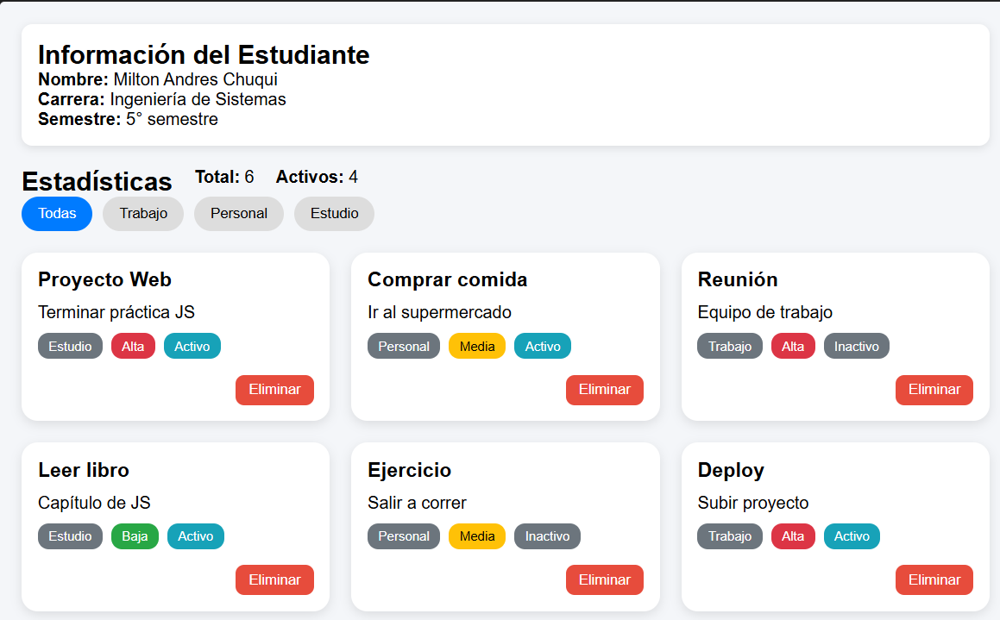
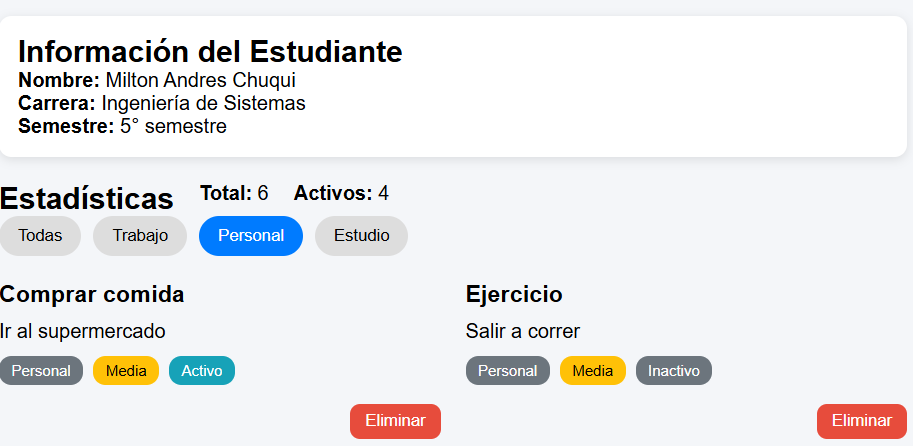

# Practica 2 - DOM

## Solución 

- En esta práctica se desarrolló una aplicación web utilizando JavaScript enfocada en la manipulación dinámica del DOM. Se trabajó en la visualización de datos del estudiante, la generación automática de listas de elementos y la interacción con estos mediante filtros y acciones como eliminar registros.
---
## Código relevante

### Renderizado de la lista
```javascript
function renderizarLista(datos) {
  const contenedor = document.getElementById('contenedor-lista');
  contenedor.innerHTML = '';

  const fragment = document.createDocumentFragment();

  datos.forEach(el => {
    const card = document.createElement('div');
    card.classList.add('card');

    const titulo = document.createElement('h3');
    titulo.textContent = el.titulo;

    const descripcion = document.createElement('p');
    descripcion.textContent = el.descripcion;

    const categoria = document.createElement('span');
    categoria.textContent = el.categoria;
    categoria.classList.add('badge', 'badge-categoria');

    const prioridad = document.createElement('span');
    prioridad.textContent = el.prioridad;
    prioridad.classList.add('badge');

    const estado = document.createElement('span');
    estado.textContent = el.activo ? 'Activo' : 'Inactivo';
    estado.classList.add('badge');

    const btnEliminar = document.createElement('button');
    btnEliminar.textContent = 'Eliminar';
    btnEliminar.classList.add('btn-eliminar');

    btnEliminar.addEventListener('click', () => {
      eliminarElemento(el.id);
    });

    const badges = document.createElement('div');
    badges.classList.add('badges');
    badges.appendChild(categoria);
    badges.appendChild(prioridad);
    badges.appendChild(estado);

    const acciones = document.createElement('div');
    acciones.classList.add('card-actions');
    acciones.appendChild(btnEliminar);

    card.appendChild(titulo);
    card.appendChild(descripcion);
    card.appendChild(badges);
    card.appendChild(acciones);

    fragment.appendChild(card);
  });

  contenedor.appendChild(fragment);
  actualizarEstadisticas();
}
```
### Eliminacion de elementos
```javascript
function eliminarElemento(id) {
  elementos = elementos.filter(el => el.id !== id);
  renderizarLista(elementos);
}
```
### Filtrado
```javascript
function inicializarFiltros() {
  const botones = document.querySelectorAll('.btn-filtro');

  botones.forEach(btn => {
    btn.addEventListener('click', () => {
      const categoria = btn.dataset.categoria;

      document.querySelectorAll('.btn-filtro')
        .forEach(b => b.classList.remove('btn-filtro-activo'));

      btn.classList.add('btn-filtro-activo');

      if (categoria === 'todas') {
        renderizarLista(elementos);
      } else {
        const filtrados = elementos.filter(e => e.categoria === categoria);
        renderizarLista(filtrados);
      }
    });
  });
}
```

## Ejemplos de funciones principales
__Renderizado de la lista__

La función renderizarLista() genera dinámicamente los elementos en pantalla a partir de un arreglo, creando tarjetas con sus datos como título, descripción, categoría, prioridad y estado.

__Eliminación de elementos:__

La función eliminarElemento() permite eliminar un elemento del arreglo según su id y luego actualiza la vista de la lista.

__Filtrado de elementos:__

La función inicializarFiltros() muestra los elementos según la categoría seleccionada mediante botones, o todos si se elige la opción general.
## Imágenes

### Vista general de la aplicacion


**Descripción:** La aplicación termina viendose a si despues de aplicar estilos.

### Filtrado aplicado


**Descripción:** Muestra de funcionamiento del filtrado, mostrando solamente la categoria elejida.

