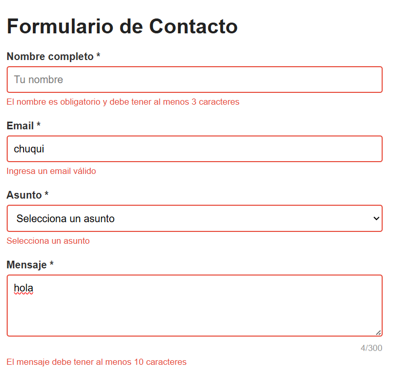
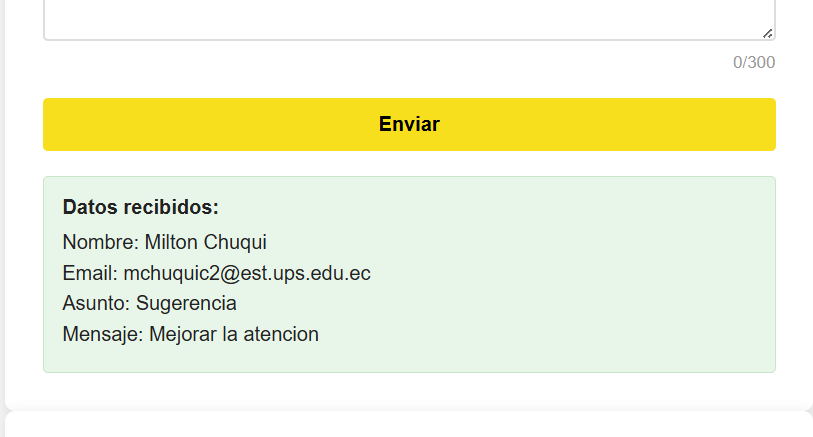
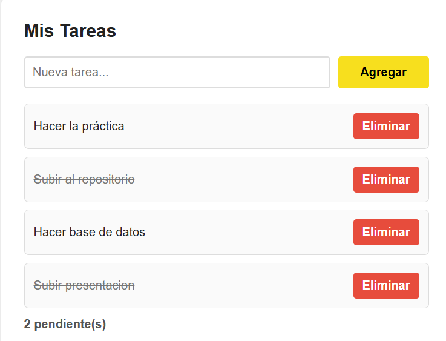
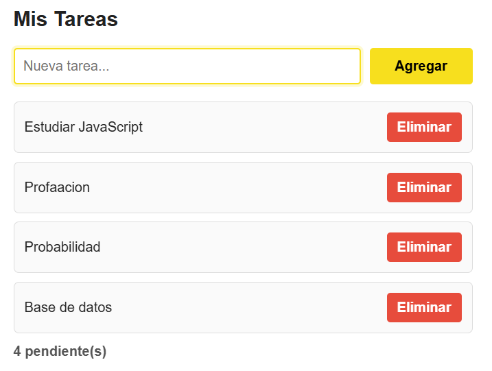
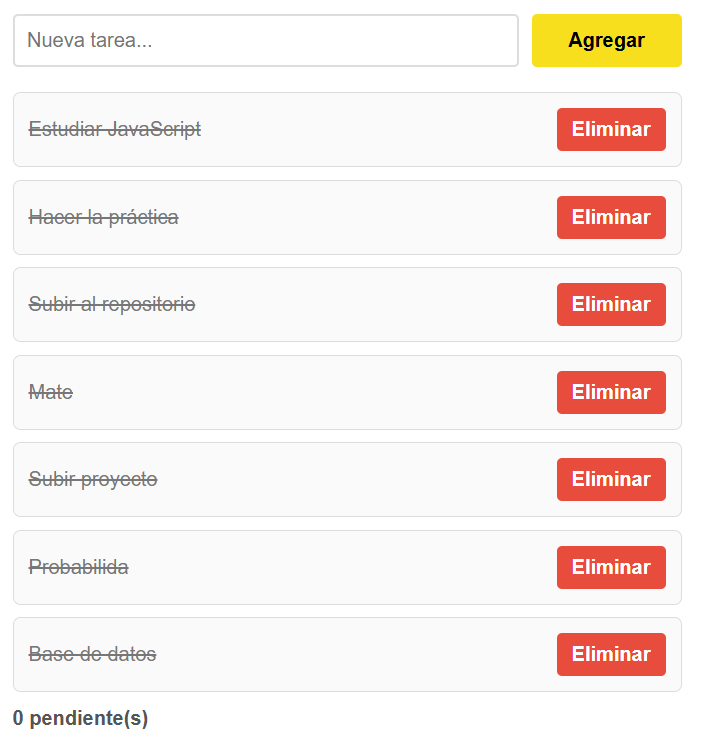

### Práctica Eventos

## DESCRIPCIÓN DE LA SOLUCIÓN
- En esta práctica se desarrolló una aplicación web interactiva utilizando JavaScript, enfocada en la manipulación del DOM y el manejo de eventos. Se implementaron validaciones de formulario, gestión dinámica de tareas, filtrado de elementos y funcionalidades avanzadas como atajos de teclado y event delegation para mejorar el rendimiento y la experiencia de usuario.

## Funcionalidades implementadas
__Formulario de contacto__

- Validación de campos en tiempo real usando eventos.
- Verificación de email con expresiones regulares.
- Contador dinámico de caracteres en el mensaje.
- Visualización de errores de forma interactiva.
- Envío controlado del formulario con preventDefault().
- Atajo de teclado Ctrl + Enter para envío rápido.

__Sistema de tareas__
- Agregar tareas dinámicamente desde la interfaz.
- Marcar tareas como completadas o pendientes.
- Eliminar tareas individualmente.
- Contador automático de tareas pendientes.
- Uso de delegación de eventos para optimizar interacciones.

## Código destacado
### Validación de formulario con preventDefault()
```javascript
formulario.addEventListener('submit', (e) => {
  e.preventDefault();

  const nombreValido = validarNombre();
  const emailValido = validarEmail();
  const asuntoValido = validarAsunto();
  const mensajeValido = validarMensaje();

  if (nombreValido && emailValido && asuntoValido && mensajeValido) {
    mostrarResultado();
    resetearFormulario();
    return;
  }
});

```

## Event delegation en la lista de tareas
```javascript
listaTareas.addEventListener('click', (e) => {
  const action = e.target.dataset.action;

  if (!action) return;

  const item = e.target.closest('li');
  if (!item) return;

  const id = Number(item.dataset.id);

  if (action === 'eliminar') {
    tareas = tareas.filter(t => t.id !== id);
    renderizarTareas();
    return;
  }

  if (action === 'toggle') {
    const tarea = tareas.find(t => t.id === id);
    tarea.completada = !tarea.completada;
    renderizarTareas();
  }
});
```
## Atajo de teclado Ctrl + Enter
```javascript
document.addEventListener('keydown', (e) => {
  if (e.ctrlKey && e.key === 'Enter') {
    e.preventDefault();
    formulario.requestSubmit();
  }
});
```

## Capturas
### Validacion de Datos

**Descripción:** Se muestra el funcionamiento de la validacion de campos.
### Formulario procesado

**Descripción:** Se muestra el formulario correctamente enviado.
### Event delegation funcionando

**Descripción:** Se muestra el coorecto funcionamiento de eliminar y marcar tareas completas mediante delegacion de eventos.
### Contador de tareas actualizado

**Descripción:** Se actualiza correctamente al agregar o eliminar alguna tarea.

## Tareas completadas

**Descripción:** todas las tareas completadas se muestran tachadas.