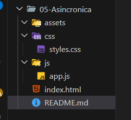
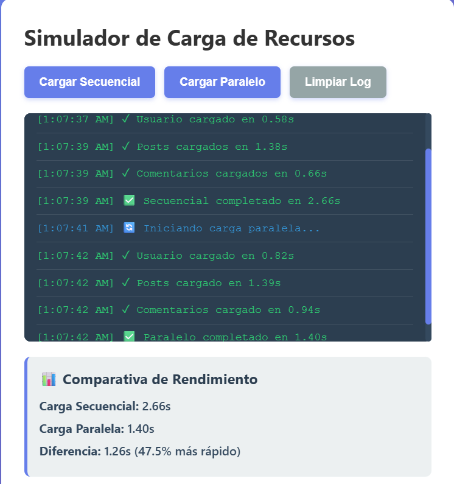
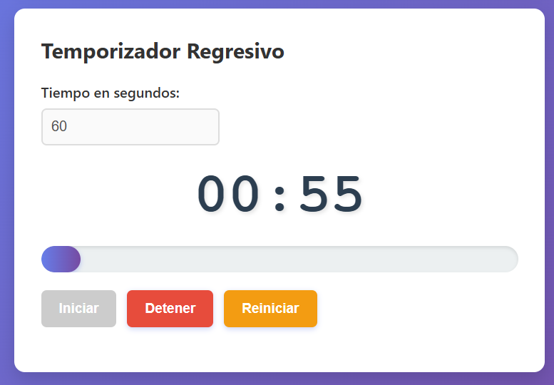
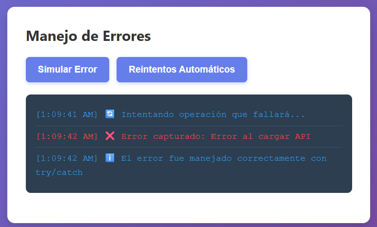
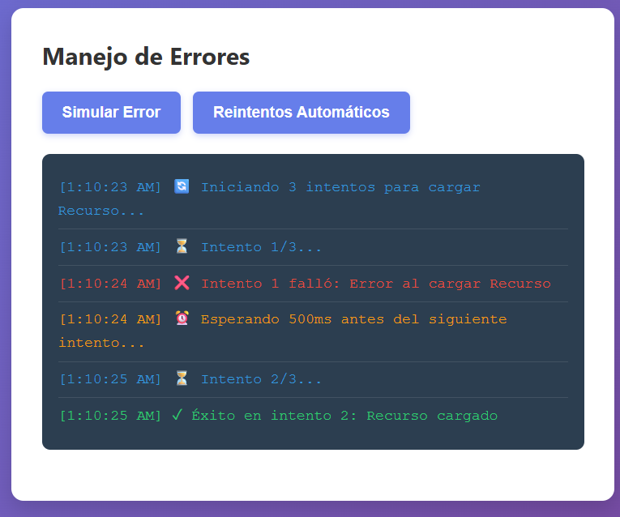

# Práctica-05-Asincronica
__Descripción del simulador implementado__

En esta práctica se desarrolló un simulador de asincronía en JavaScript que permite comparar el rendimiento entre carga secuencial y paralela de peticiones. Además, se implementó un temporizador regresivo con barra de progreso y un sistema de manejo de errores con reintentos automáticos, aplicando conceptos como promesas, async/await y control de flujo asíncrono.


## Funcionalidades implementadas
__Simulador de carga:__
- Simulación de peticiones usando Promise y setTimeout
- Ejecución secuencial con await
- Ejecución paralela con Promise.all()
- Comparación de tiempos entre ambos métodos
- Registro de eventos en un log dinámico

__Temporizador:__
- Ingreso de tiempo en segundos
- Visualización en formato MM:SS
- Barra de progreso animada
- Cambio de estado visual en los últimos 10 segundos
- Controles de iniciar, detener y reiniciar

__Manejo de errores:__
- Simulación de errores en promesas
- Captura de errores con try/catch
- Sistema de reintentos automáticos
- Backoff exponencial entre intentos
-Registro de errores en pantalla

## Código destacado

### Función que retorna promesa con setTimeout
```javascript
function simularPeticion(nombre, tiempoMin = 500, tiempoMax = 2000, fallar = false) {
  return new Promise((resolve, reject) => {
    const tiempoDelay = Math.floor(Math.random() * (tiempoMax - tiempoMin + 1)) + tiempoMin;

    setTimeout(() => {
      if (fallar) {
        reject(new Error(`Error al cargar ${nombre}`));
      } else {
        resolve({
          nombre,
          tiempo: tiempoDelay,
          timestamp: new Date().toLocaleTimeString()
        });
      }
    }, tiempoDelay);
  });
}
```

### Carga secuencial con await
```javascript
const usuario = await simularPeticion('Usuario');
const posts = await simularPeticion('Posts');
const comentarios = await simularPeticion('Comentarios');
```
### Carga paralela con Promise.all
```javascript
const promesas = [
  simularPeticion('Usuario'),
  simularPeticion('Posts'),
  simularPeticion('Comentarios')
];

const resultados = await Promise.all(promesas);
```
### Manejo de errores con try/catch
```javascript
try {
  await simularPeticion('API', 500, 1000, true);
} catch (error) {
  console.log('Error capturado:', error.message);
}
```
### Temporizador con setInterval
```javascript
intervaloId = setInterval(() => {
  tiempoRestante--;
  actualizarDisplay();

  if (tiempoRestante <= 0) {
    clearInterval(intervaloId);
  }
}, 1000);
```

## Análisis de rendimiento
La carga secuencial ejecuta las peticiones una por una, lo que genera un tiempo total mayor debido a la suma de todas las esperas. En cambio, la carga paralela ejecuta todas las peticiones simultáneamente, reduciendo el tiempo total al de la petición más lenta. Esto demuestra la eficiencia del uso de Promise.all frente a await secuencial.

## Capturas
### Estructura del proyecto


**Descripción:** Se muestra la correcta estrcutura del proyecto.

### Secuencia VS Paralela

**Descripción:** Se observa la diferencia de tiempo entre la ejecución secuencial (más lenta) y la paralela (más rápida al ejecutarse simultáneamente).

### Temporizador

**Descripción:** Muestra el temporizador en funcionamiento con la barra de progreso actualizándose en tiempo real y cambio de color al final.

### Errores




**Descripción:** Se evidencia un error capturado con try/catch y mostrado en la interfaz sin detener la aplicación.