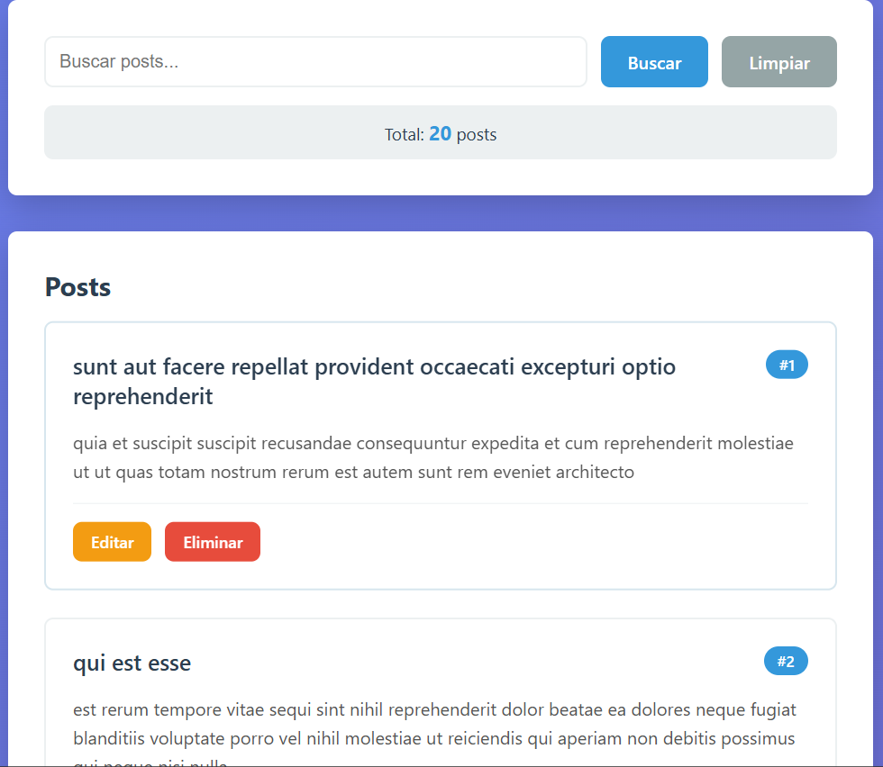
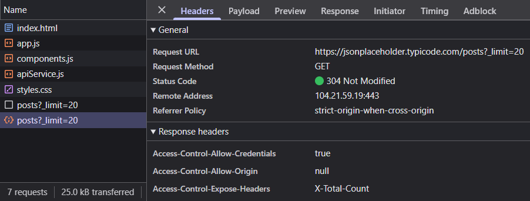
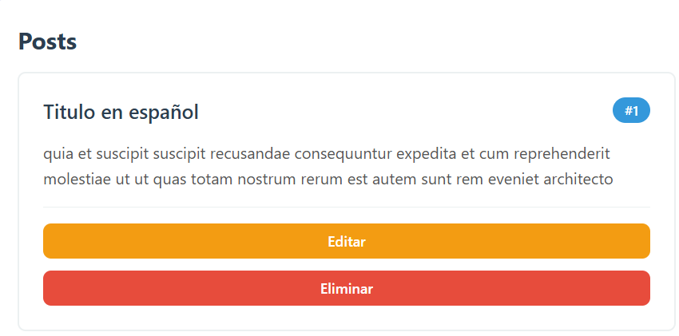
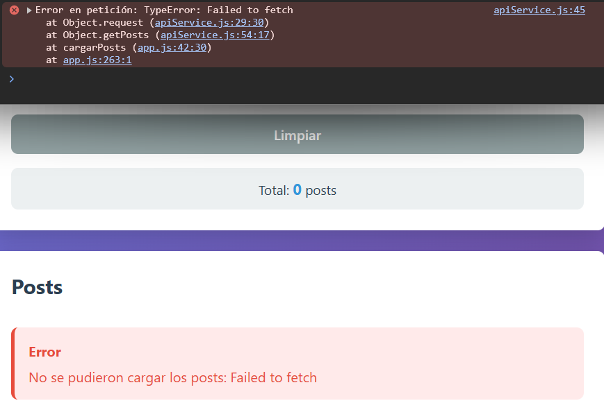
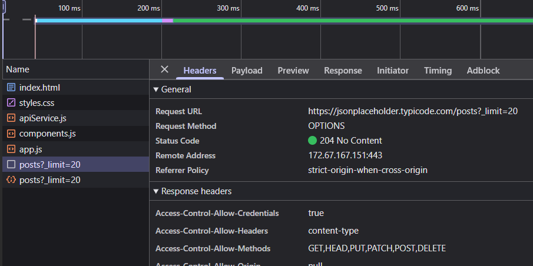

# Práctica 6 Fetch Api

## Descripción general

La aplicación desarrollada permite gestionar una lista de datos consumidos desde una API externa, aplicando operaciones básicas como crear, leer, actualizar y eliminar información. Se implementa una interfaz dinámica que responde a las acciones del usuario en tiempo real, mostrando estados como carga, éxito y error, lo que mejora la experiencia de uso y la interacción con el sistema.

---

## **Evidencias**

### _1. Lista Cargada_



**Descripcion:** Se muestran los datos obtenidos de la API renderizados correctamente en la interfaz.

---

### _2. Spinner_



**Descripcion:** Se visualiza el indicador de carga mientras se obtienen los datos del servidor.

---

### _3. Crear_


**Descripcion:** Se evidencia el envío del formulario y la aparición de un nuevo elemento en la lista.

---

### _4. Editar_



**Descripcion:** Se observa la modificación de un elemento existente reflejada en la interfaz.

---

### _5. Eliminar_


**Descripcion:** Se muestra la eliminación de un elemento de la lista de forma dinámica.

---

### _6. Error_



**Descripcion:** Se presenta un mensaje de error cuando ocurre un fallo en la petición a la API.

---

### _7. DevTools Network_



**Descripcion:** Se visualizan las peticiones HTTP (GET, POST, PUT, DELETE) en la pestaña Network del navegador.

---

### _8. Código Servicio Api y Componentes_

```javascript
const ApiService = {
  baseUrl: "https://jsonplaceholder.typicode.com",

  async request(endpoint, options = {}) {
    const url = `${this.baseUrl}${endpoint}`;

    const config = {
      headers: {
        "Content-Type": "application/json",
        ...options.headers,
      },
      ...options,
    };

    const response = await fetch(url, config);

    if (!response.ok) {
      throw new Error(`HTTP Error: ${response.status}`);
    }

    return response.status === 204 ? null : await response.json();
  },

  // GET
  async getPosts(limit = 10) {
    return this.request(`/posts?_limit=${limit}`);
  },

  // POST
  async createPost(postData) {
    return this.request("/posts", {
      method: "POST",
      body: JSON.stringify(postData),
    });
  },

  // PUT
  async updatePost(id, postData) {
    return this.request(`/posts/${id}`, {
      method: "PUT",
      body: JSON.stringify(postData),
    });
  },

  // DELETE
  async deletePost(id) {
    return this.request(`/posts/${id}`, {
      method: "DELETE",
    });
  },
};
```

**Descripcion:** El servicio API se implementa mediante un objeto que centraliza las peticiones HTTP utilizando fetch, permitiendo realizar operaciones CRUD (GET, POST, PUT y DELETE) de forma organizada. El método request gestiona la configuración de las solicitudes, el manejo de errores y la conversión de las respuestas a formato JSON, lo que facilita la reutilización del código y mejora la eficiencia en la comunicación con el servidor.

---

### Componentes:

```javascript
function PostCard(post) {
  const article = document.createElement("article");
  article.className = "post-card";

  const title = document.createElement("h3");
  title.textContent = post.title;

  const body = document.createElement("p");
  body.textContent = post.body;

  const btnEliminar = document.createElement("button");
  btnEliminar.textContent = "Eliminar";

  article.appendChild(title);
  article.appendChild(body);
  article.appendChild(btnEliminar);

  return article;
}

function MensajeError(mensaje) {
  const container = document.createElement("div");
  container.className = "error";

  const texto = document.createElement("p");
  texto.textContent = mensaje;

  container.appendChild(texto);
  return container;
}

function MensajeExito(mensaje) {
  const container = document.createElement("div");
  container.className = "success";

  const texto = document.createElement("p");
  texto.textContent = mensaje;

  container.appendChild(texto);
  return container;
}
```

**Descripcion:**
Los componentes se construyen dinámicamente utilizando la API del DOM mediante createElement, evitando el uso de innerHTML y mejorando la seguridad del código. Estos componentes permiten renderizar elementos como tarjetas de posts y mensajes de estado (error o éxito), organizando la interfaz de manera modular y reutilizable, lo que facilita el mantenimiento y la escalabilidad de la aplicación.
