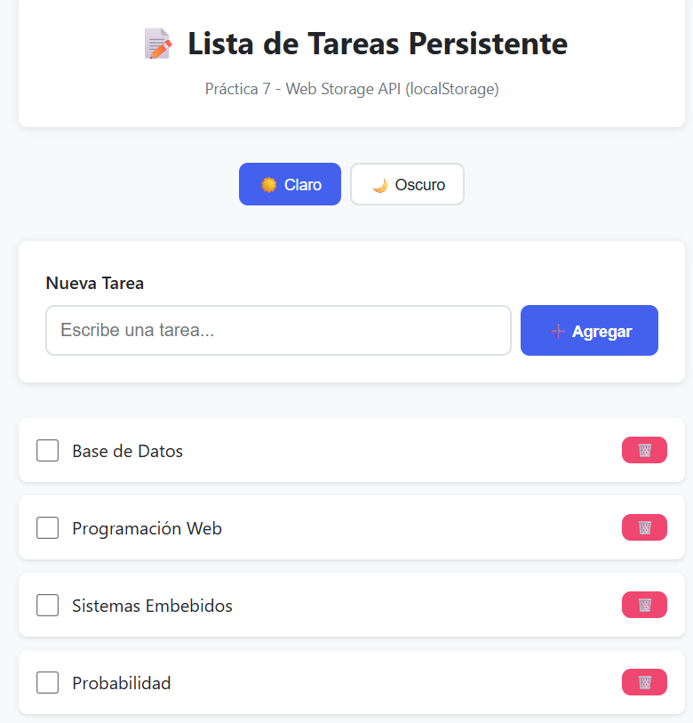
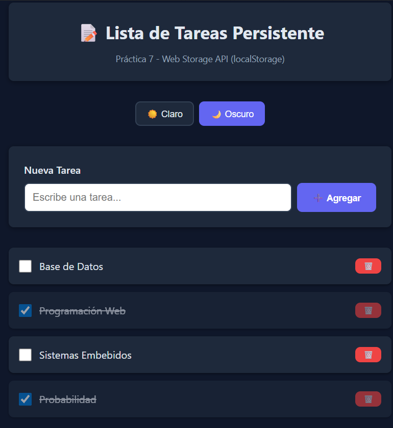
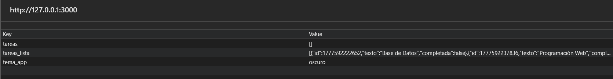

# Practica 7 Storage

## Evidencias

### _1. Lista con datos_


**Descripcion:** Se agregaron 4 tareas que fueron listadas exitosamente

---

### _2. Persistencia_



**Descripcion:** Al recargar la pagina las tareas persisten.

---

### _3. Cambiar tema_



**Descripcion:** Se cambia a tema oscuro.

---

### _4. DevTools_



**Descripcion:** Se observan las claves tareas_lista y tema_app.

### _5. Codigo: Storage y App_

### Storage.js

```javascript
"use strict";

/* =========================
   SERVICIO DE STORAGE
========================= */

const TareaStorage = {
  CLAVE: "tareas_lista",

  getAll() {
    try {
      const datos = localStorage.getItem(this.CLAVE);
      if (!datos) {
        return [];
      }
      return JSON.parse(datos);
    } catch (error) {
      console.error("Error al leer tareas:", error);
      return [];
    }
  },

  guardar(tareas) {
    try {
      localStorage.setItem(this.CLAVE, JSON.stringify(tareas));
    } catch (error) {
      console.error("Error al guardar tareas:", error);
    }
  },

  crear(texto) {
    const tareas = this.getAll();

    const nueva = {
      id: Date.now(),
      texto: texto.trim(),
      completada: false,
    };

    tareas.push(nueva);

    this.guardar(tareas);

    return nueva;
  },

  toggleCompletada(id) {
    const tareas = this.getAll();

    const tarea = tareas.find((t) => t.id === id);

    if (tarea) {
      tarea.completada = !tarea.completada;
    }

    this.guardar(tareas);
  },

  eliminar(id) {
    const tareas = this.getAll();

    const filtradas = tareas.filter((t) => t.id !== id);

    this.guardar(filtradas);
  },

  limpiarTodo() {
    localStorage.removeItem(this.CLAVE);
  },
};
```

### App.js

```javascript
function renderizarTareas() {
  listaTareas.innerHTML = "";

  if (tareas.length === 0) {
    const p = document.createElement("p");
    p.textContent = "No hay tareas";
    listaTareas.appendChild(p);
    return;
  }

  tareas.forEach((tarea) => {
    const el = crearElementoTarea(tarea);
    listaTareas.appendChild(el);
  });
}
function agregarTarea(texto) {
  if (!texto.trim()) {
    mostrarMensaje("El texto no puede estar vacío", "error");
    return;
  }

  const nueva = TareaStorage.crear(texto);

  tareas = TareaStorage.getAll();
  renderizarTareas();

  mostrarMensaje(`Tarea agregada`);
}

function eliminarTarea(id) {
  TareaStorage.eliminar(id);

  tareas = TareaStorage.getAll();
  renderizarTareas();

  mostrarMensaje("Tarea eliminada");
}

function toggleTarea(id) {
  TareaStorage.toggleCompletada(id);
  tareas = TareaStorage.getAll();
  renderizarTareas();
}

function aplicarTema(nombreTema) {
  if (nombreTema === "oscuro") {
    document.body.classList.add("tema-oscuro");
  } else {
    document.body.classList.remove("tema-oscuro");
  }

  TemaStorage.setTema(nombreTema);
}

const temaGuardado = TemaStorage.getTema();
aplicarTema(temaGuardado);

cargarTareas();
```

**Descripcion:** Los archivos controlan la lógica de la aplicación, permitiendo agregar, eliminar y actualizar tareas dinámicamente en la interfaz. También gestiona la persistencia de datos y el tema usando localStorage, asegurando que la información se mantenga al recargar la página.
