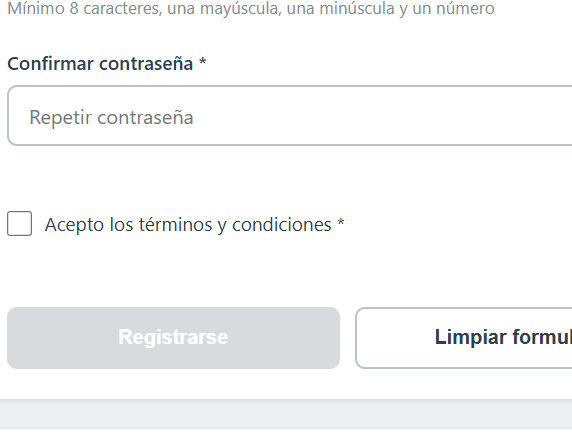
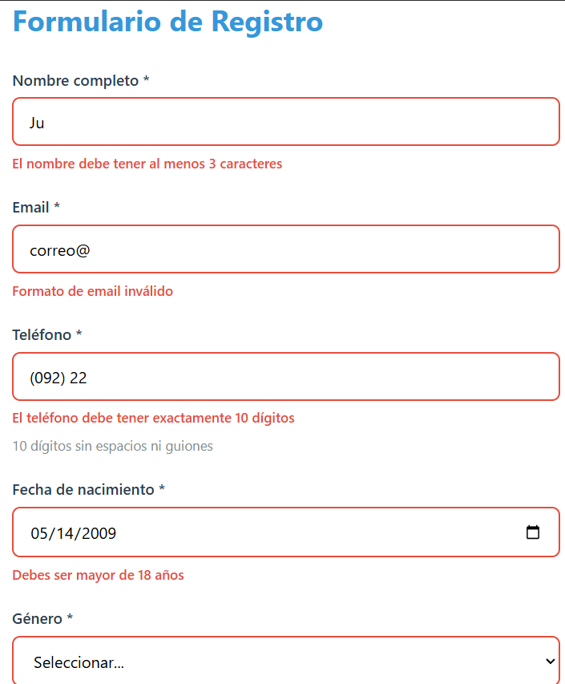
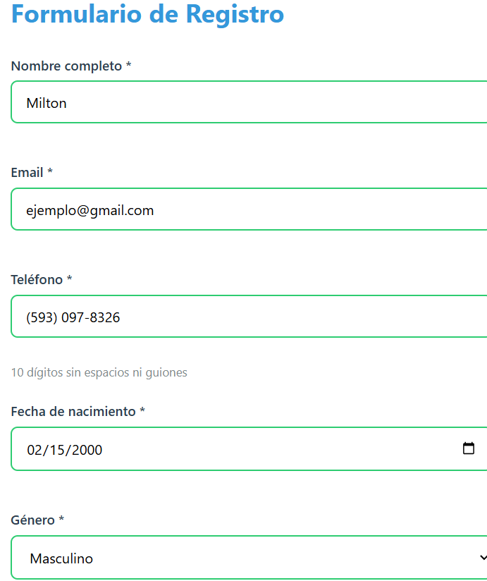
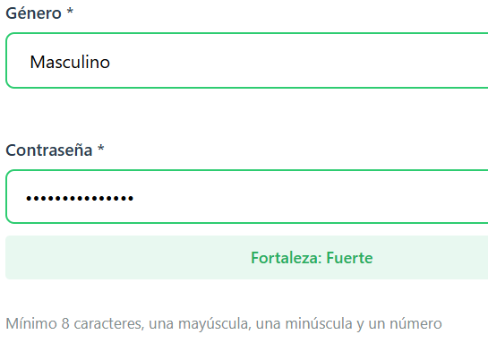
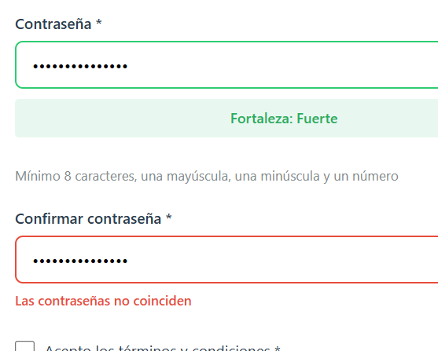
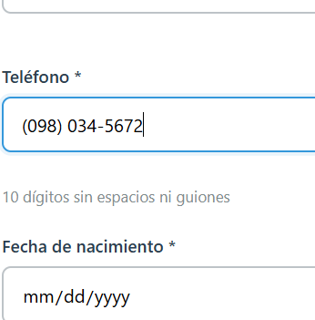
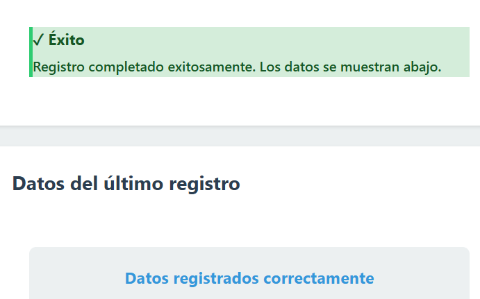
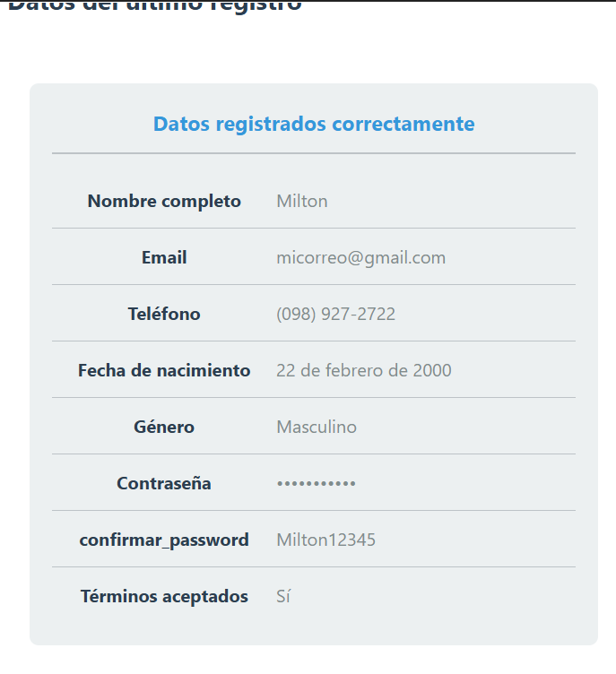
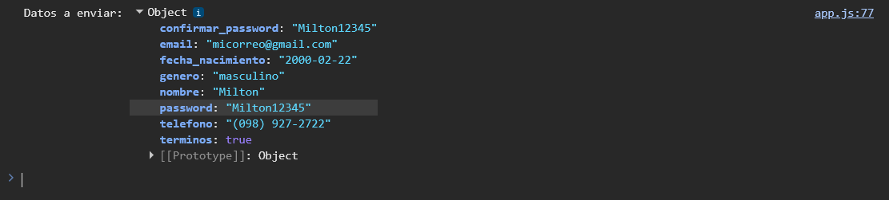

# Práctica 8 Formulario

### _1. Formulario vacío con botón deshabilitado_



**Descripcion:** El boton registrarse no esta habilitado mientras no haya ningun campo lleno.

---

### _2. Errores de validación_



**Descripcion:** Se muestra un mensaje en cada campo si este está mal completado, sugiriendo que esta mal.

---

### _3. Campos válidos_



**Descripcion:** Si los datos estan bien rellenados se marcara cada casiila con un color verde que significa que todo esta bien.

---

### _4. Indicador de fuerza de contraseña_



**Descripcion:** Muestra la fuerza de la contraseña (muy debil, debil, fuerte, muy fuerte, etc) cada uno con un color diferente para mostrar la fuerza de la contraseña.

---

### _5. Error de contraseñas no coinciden_



**Descripcion:** Si las contraseñas no son iguales se muestra una alerta.

---

### _6. Máscara de teléfono_



**Descripcion:** Formateo automático a (099) 999-9999 mientras el usuario escribe.

---

### _7. Envío exitoso_



**Descripcion:** Al registrarse se muestra una aleta que ha sido exitoso.

---

### _8. Tarjeta de resultado_



**Descripcion:** Se muetran los datos correctamente registrados.

---

### _9. Consola_



**Descripcion:** Comprobación de la captura de los datos procesados mediante FormData.

---

### _10. Código Componentes y validación_

### Componentes:

```javascript
/**
 * Componente de mensaje de éxito
 * @param {string} mensaje - Mensaje de éxito a mostrar
 * @returns {HTMLElement} - Elemento div del DOM
 */
function MensajeExito(mensaje) {
  const container = document.createElement("div");
  container.className = "mensaje-exito";

  const titulo = document.createElement("strong");
  titulo.textContent = "✓ Éxito";

  const texto = document.createElement("p");
  texto.textContent = mensaje;

  container.appendChild(titulo);
  container.appendChild(texto);

  return container;
}

/**
 * Componente de mensaje de error
 * @param {string} mensaje - Mensaje de error a mostrar
 * @returns {HTMLElement} - Elemento div del DOM
 */

function MensajeError(mensaje) {
  const container = document.createElement("div");
  container.className = "mensaje-error";

  const titulo = document.createElement("strong");
  titulo.textContent = "✗ Error";

  const texto = document.createElement("p");
  texto.textContent = mensaje;

  container.appendChild(titulo);
  container.appendChild(texto);

  return container;
}
```

### Validación

```javascript

const ValidacionService = {
  validarCampo(campo) {
    const valor = campo.value.trim();
    const nombre = campo.name;
    const tipo = campo.type;
    let error = "";

    // REQUIRED
    if (campo.hasAttribute("required")) {
      if (tipo === "checkbox") {
        if (!campo.checked) {
          error = "Debes aceptar este campo";
        }
      } else if (!valor) {
        error = "Este campo es obligatorio";
      }
    }

    if (error) {
      return { valido: false, error };
    }

    if (valor) {
      switch (nombre) {
        case "nombre":
          if (valor.length < 3) {
            error = "El nombre debe tener al menos 3 caracteres";
          } else if (valor.length > 50) {
            error = "El nombre no puede superar 50 caracteres";
          } else if (!REGEX.soloLetras.test(valor)) {
            error = "El nombre solo puede contener letras y espacios";
          }
          break;

        case "email":
          if (!REGEX.email.test(valor)) {
            error = "Formato de email inválido";
          }
          break;

        case "telefono":
          const limpio = valor.replace(/\D/g, "");
          if (!REGEX.telefono.test(limpio)) {
            error = "El teléfono debe tener exactamente 10 dígitos";
          }
          break;

        case "fecha_nacimiento":
          const fechaNac = new Date(valor);
          const hoy = new Date();

          let edad = hoy.getFullYear() - fechaNac.getFullYear();
          const mesActual = hoy.getMonth() - fechaNac.getMonth();

          if (
            mesActual < 0 ||
            (mesActual === 0 && hoy.getDate() < fechaNac.getDate())
          ) {
            edad--;
          }

          if (edad < 18) {
            error = "Debes ser mayor de 18 años";
          } else if (edad > 120) {
            error = "Fecha de nacimiento inválida";
          }
          break;

        case "genero":
          if (!valor) {
            error = "Debes seleccionar un género";
          }
          break;

        case "password":
          if (valor.length < 8) {
            error = "La contraseña debe tener al menos 8 caracteres";
          } else if (!/[A-Z]/.test(valor)) {
            error = "Debe tener al menos una letra mayúscula";
          } else if (!/[a-z]/.test(valor)) {
            error = "Debe tener al menos una letra minúscula";
          } else if (!/[0-9]/.test(valor)) {
            error = "Debe tener al menos un número";
          }
          break;

        case "confirmar_password":
          const password = document.querySelector('[name="password"]').value;
          if (valor !== password) {
            error = "Las contraseñas no coinciden";
          }
          break;
      }
    }

    return {
      valido: error === "",
      error,
    };
  },

  validarFormulario(form) {
    // Seleccionar campos
    const campos = form.querySelectorAll("input, select, textarea");

    // Variable de control
    let todosValidos = true;

    // Recorrer campos
    campos.forEach((campo) => {
      const resultado = this.validarCampo(campo);

      if (!resultado.valido) {
        mostrarError(campo, resultado.error);
        todosValidos = false;
      } else {
        limpiarError(campo);
      }
    });

    return todosValidos;
  },
```
